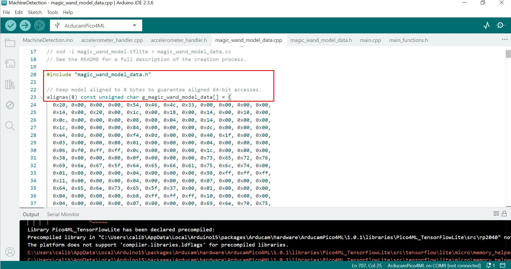

# FaultyBearing-Diagnosis-Pico4ML
This github repository goes through the flow of how the faulty bearing diagnostic system was designed.

The applications used are: Arduino IDE, Jupyter Lab & VS Code

The content goes as follows:
1. Pico4ML Libraries & Board Manager in Arduino IDE
2. Data collection
    1. Printing of Accelerometer values on Serial monitor (Arduino IDE)
    2. Extracting of values from serial monitor & recording onto Excel sheets
3. Data Processing & Training of Model
    1. Data Preprocessing
    2. Model Architecture and Training
    3. Quantization of Model
4. Model conversion from format .tflite > .c
5. Implement the model into Pico4ML
6. Observe model outputs

# 1. Pico4ML Libraries & Board Managers

Add the above library to the Arduino IDE

Add the above board extension to Arduino IDE

https://www.arducam.com/downloads/Pico/package_pico4ML_index.json

In File > Preferences > Additional boards manager URL, add this link

# 2. Data Collection
i. Download the folder named - 'Data_Collection_i', execute and flash into the Pico4ML
Open up the serial monitor and the outputs should look like this:
>Add Image here< - this should be the serial monitor for accel values

ii. Download the file named - 'Data_Collection_ii'
Run it with a python compiler when the Pico4ML is running and outputting accelerometer values.
>Add Image Here< - this should be the python output showing Logged values

# 3. Data Preprocessing & Training of Model
Download the file named - 'Data_Preprocessing_Training_Model.ipynb'

When standardizing, take note of the Std and Mean values for axes x, y, z.
Use the datasets retrieved in 'Data Collection', train and observe results.
Once satisfactory results are observed, quantize the model.

# 4. Converting TFLite file into C array

Use a Vim to convert the .tflite file to .c format with the above command.

# 5. Implement the Model into Pico4ML

Change the variable names of the C Array model to the same as the above two images.

Once the variables are the same, copy and paste the model into the 'magic_wand_model_data.cpp' folder.

In the file named - 'MachineDetection.ino', change the operations to the operations used during Model Training. However, do take note of the supported operations in TFLite Micro.

In the file named - 'accelerometer_handler.cpp', change the values to the ones used during standardization in section 'Data Preprocessing & Training of Model' as shown in the picture above.

# 6. Observe Results of the Model
The model should be outputting raw logits and the highest raw logit represents the model's prediction.
>Add Image of Normal model raw logits<
>Add Image of Outer model raw logits<
>Add Image of Inner model raw logits<
>Add Image of Cage model raw logits<
